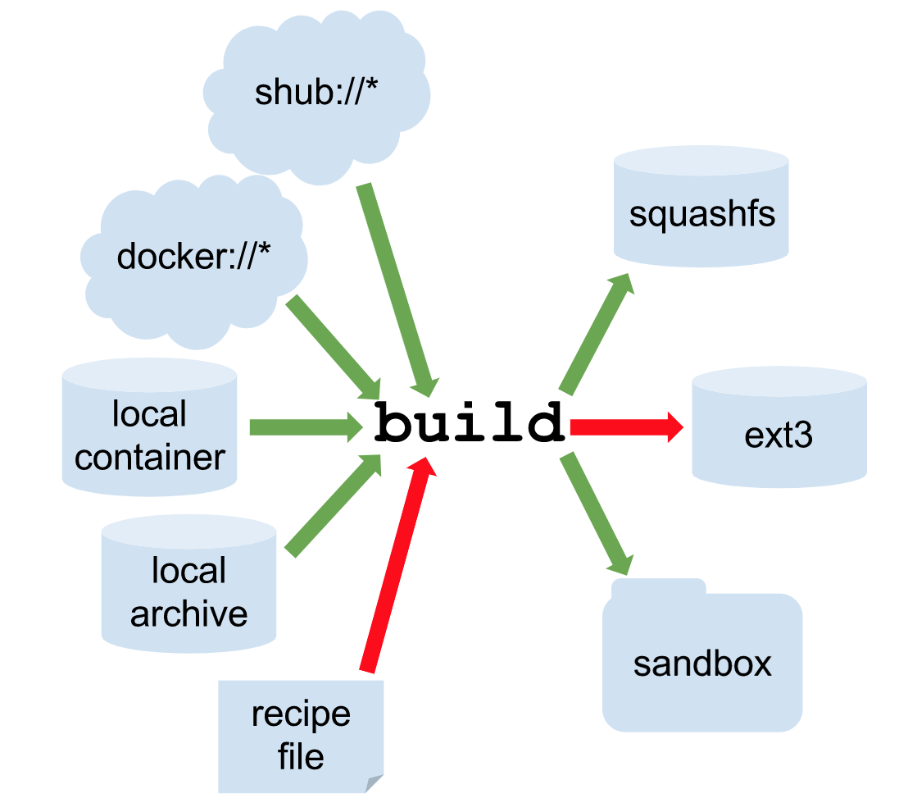
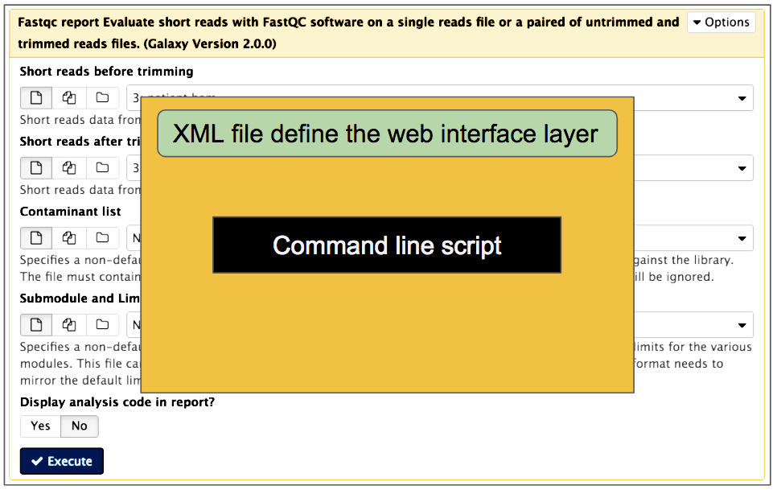
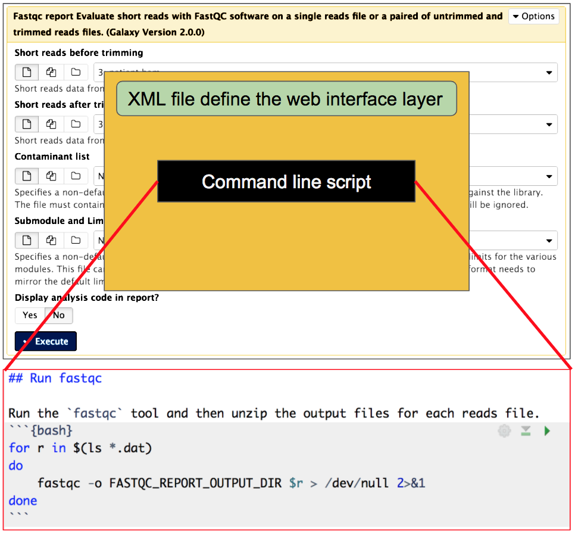
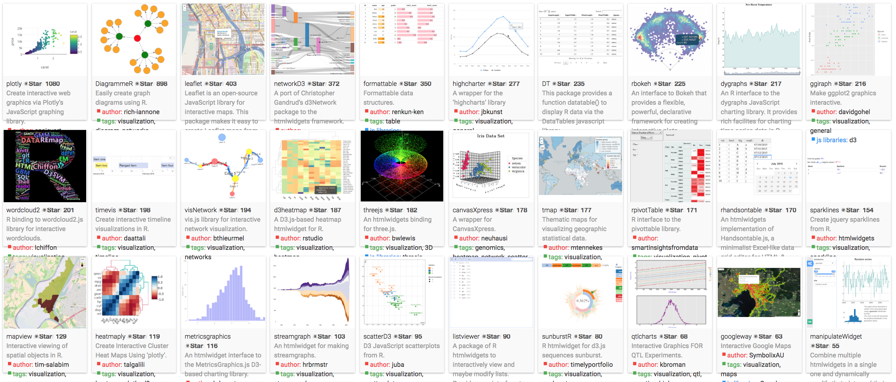
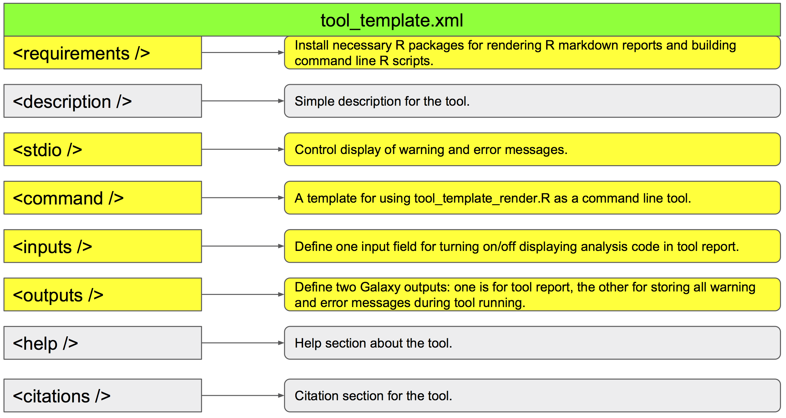
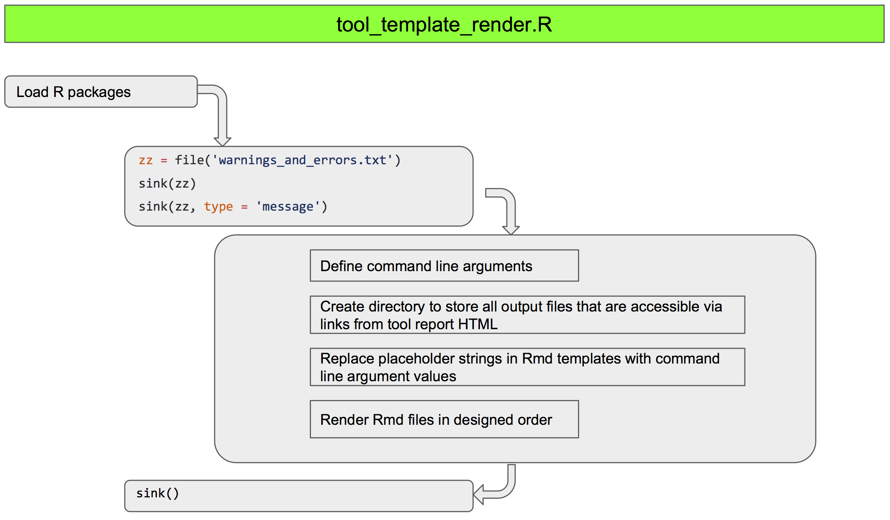
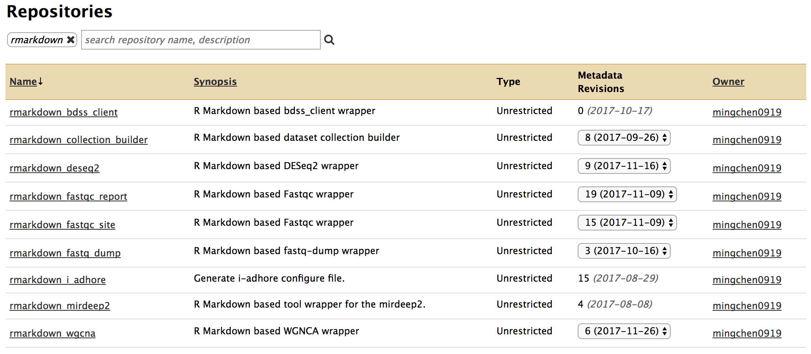
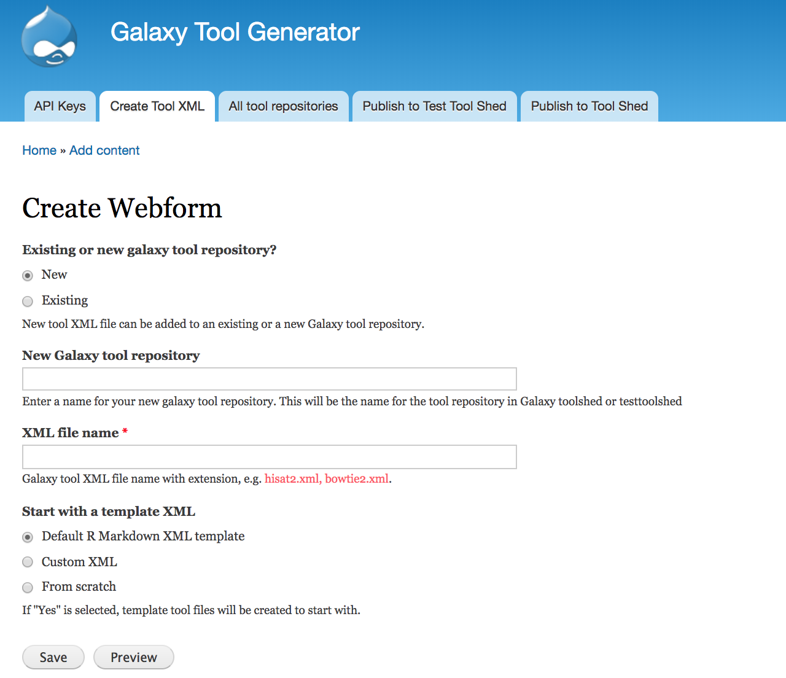
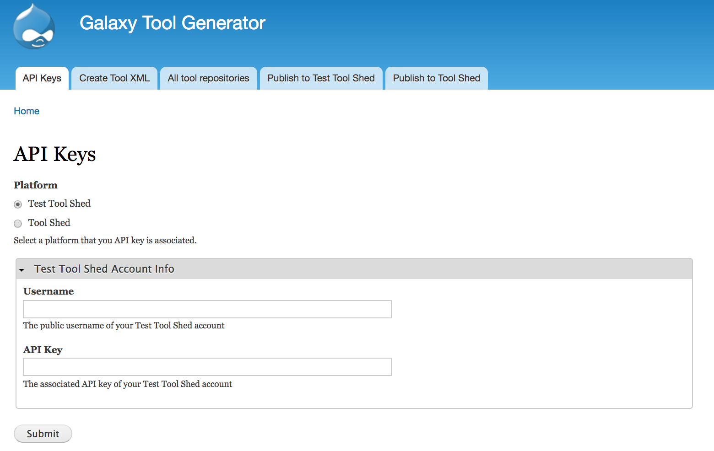
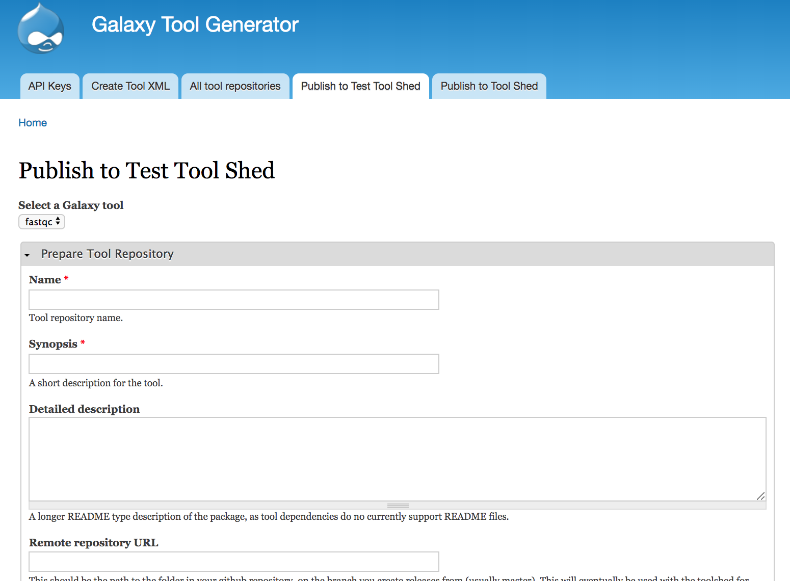

```{r setup, include=FALSE}
knitr::opts_chunk$set(echo = FALSE)
```


## Overview

- Singularity container
- Tripal Galaxy and Galaxy workflows
- Updates on R Markdown Galaxy tools
- Galaxy tool generator platform

## Singularity Container

### What can container technologies do for you?

>- You can put an OS into a container and install all kinds of tools and apps into the system.
>- You can transfer the container to a different computer and use the tools and apps within the container.
>- From the view of biologists, container technologies allow you to have all kinds flavors of virtual computers and stably move these computers around.

## Singularity Container

### Building containers

- Can be built from receipe files
- Can be easily done by pulling existing containers from container repositories
- Can pull containers from Docker container repository

```{r, out.width = "400px", fig.align='center'}

```

## Singularity Container

### What is cool about Singularity container?

>- You don't need privileged permission to run singularity container. HPC cluster users usually don't have privileged permission.
>- You can build containers locally and install tools as root user. Then you can run the containers on the HPC cluster and use tools that you usually don't have permission to install.

## Singularity Container

### Demo

Pull a container with R installed on my local computer.

```{bash eval=FALSE, echo=TRUE}
singularity build --writable r.img docker://r-base
```

Install a testing package as root user.

```{bash eval=FALSE, echo=TRUE}
# run container interactively
singularity shell --writable r.img

# open R and install a testing package
R
install.package('plyr')
```

Transfer the container to a HPC cluster

```{bash eval=FALSE, echo=TRUE}
scp r.img  mchen33@149.165.156.175:/home/mchen33/r.img
```

Run the container on the HPC cluster as **non-root** user.

```{bash eval=FALSE, echo=TRUE}
singularity shell r.img

# check the testing package
R
require('plyr')
```


## Tripal Galaxy and Galaxy workflows

### How biologists (assuming none or limited programming experience) can use Galaxy to perform bioinformatics analysis (Demo)

- Launch a Galaxy instance 
- Install Galaxy tools
- Build Galaxy workflows
- Run Galaxy workflows
- Build your own Galaxy docker container
- Run Galaxy workflows from a Tripal site with Tripal Galaxy module

## Tripal Galaxy and Galaxy workflows

### Launch a Galaxy instance

We are going to use the Docker container created by [Björn Grüning](https://github.com/bgruening/docker-galaxy-stable).

```{r, fig.align='center'}

```

Launch a docker container which has galaxy installed
```{bash eval=FALSE, echo=TRUE}
docker run -it --rm --name=galaxy_instance \
        -p 80:80 -p 8021:21 -p 8022:22 \
        -e "ENABLE_TTS_INSTALL=True" \
        -e "GALAXY_CONFIG_ADMIN_USERS=example@gmail.com" \
        bgruening/galaxy-stable:17.01 /bin/bash
```

Start Galaxy
```{bash eval=FALSE, echo=TRUE}
startup
```

## Tripal Galaxy and Galaxy workflows

* **Sign up an account**

    + Go to http://127.0.01.</span> 
    + Click **User->Register** and register an account with email <code>example@gmail.com</code>.</span>
<hr/>

* **Install `fastqc` and `trimmomatic`**

    + Click **Admin->Search Tool Shed->Galaxy Main Tool Shed**
    + Search for `fastqc` and select the one owned by `devteam` and install
    + Search for `trimmomatic` and select the one owned by `pjbriggs` and install
<hr/>

* **Build and run Galaxy workflows** 

    + Click **Workflow->create new workflow**
    + Give your new workflow a name and click **Create**. Here we are going to create a `reads quality control` workflow.
    + Drop the `fastqc` and `trimmomatic` tools to the workflow creating panel and connect them to create workflows.
    + Run the workflow.
<hr/>

* **Build workflow from history**

    + Click **history options** on the history panel and then click **Extract workflow**
    + You can select which steps from your analysis history to be included in your workflow.
<hr/>

* **Build your own Galaxy docker container**

    + Instead of writing Docker receipe files like [this](https://github.com/bgruening/docker-galaxy-stable/blob/master/galaxy/Dockerfile)
    + We build containers from existing container with one single command.
    <pre>
    docker commit [CONTAINER ID] mingchen0919/my-galaxy
    </pre>
    + To get the [CONTAINER ID], use the command
    <pre>
    docker ps -a
    </pre>
    + To push your container to the Docker repository for future use.
    <pre>
    docker push mingchen0919/my-galaxy
    </pre>
<hr/>    


## Tripal Galaxy and Galaxy workflows

### Run Galaxy workflows from a Tripal site with Tripal Galaxy module

* Having admin access to a running Galaxy instance.

    + http://149.165.169.134/
    
* Admin user API key

    + Click **User->Preferences->Manage API key**
    
* Link Tripal to Galaxy

    + The [Hardwood Genomics Dev site](http://160.36.205.61:8095/) has Tripal Galaxy module installed.
    + Go to the site and log in as an admin user. Click **Tripal->Extensions->Galaxy**.
    + Add Galaxy instance and workflows.
    
* Run Galaxy workflows from Tripal site

    + Go to the [workflows page](http://160.36.205.61:8095/content/tripal-galaxy-workflows)
    + Select a workflow and run.
    
## Updates on R Markdown Galaxy tools    

### What is a Galaxy tool?

```{r, out.width="800px", fig.align='center'}

```

## Updates on R Markdown Galaxy tools

### What is an R Markdown Galaxy tool?

```{r, out.width="600px", fig.align='center'}

```


## Updates on R Markdown Galaxy tools

### How R Markdown benefits the development of Galaxy tools?

- All tools render outputs in an HTML document or even a website.
- All kinds of data visualization and analysis packages from several different languages, not just R

```{r, out.width="600px", fig.align='center'}

```


## Updates on R Markdown Galaxy tools

### Templates available for developing R Markdown Galaxy tools

* [tool_template.xml](https://github.com/statonlab/docker-GRReport/blob/master/rmarkdown_tool_templates/single_report/tool_template.xml)

```{r, out.width="600px", fig.align='center'}

```

* [tool_template_render.R](https://github.com/statonlab/docker-GRReport/blob/master/rmarkdown_tool_templates/single_report/tool_template_render.R)

```{r, out.width="600px", fig.align='center'}

```


## Updates on R Markdown Galaxy tools

### R Markdown Galaxy tools on Tool Shed

```{r, out.width="800px", fig.align='center'}

```


## Galaxy Tool Generator platform

**Galaxy Tool Generator (GTG)** is a web-based platform for asisting Galaxy tool development. The components of the GTG platform includes:

  + A Drupal site
  + Two Drupal modules: `Galaxy Tool Generator` & `Galaxy Tool Generator UI`
  + A Docker container with Drupal and the two modules integrated
  + A Docker Galaxy container (optional)


## Galaxy Tool Generator platform

### What **GTG** platform can do?

- Integrates all component definitions of Galaxy tool XML - it's difficult to memorize all the [Galaxy tool XML syntax](https://docs.galaxyproject.org/en/latest/dev/schema.html).
- Drag and Drop to rearrange components of Galaxy tool interfaces - without GTG, you will have to cut, copy and paste the XML code to achieve this.
- Easily adjusting and refining the tool during development - GTG integrates all XML tags and attributes and stores previously input values. 
- Build tools with R Markdown templates.
- Build tools upon existing Galaxy tools.
- Publish tools to Tool Shed and Test Tool Shed.
- Simutaneously testing modified tools on Galaxy instance.

## Galaxy Tool Generator platform

### Start GTG platform

The module is still under development. The code below will eventually replaced by a one line command.

```{bash eval=FALSE, echo=TRUE}
mkdir -p ~/Desktop/galaxy-tool-generator-dev && cd ~/Desktop/galaxy-tool-generator-dev
git clone https://github.com/MingChen0919/galaxy_tool_generator.git
git clone https://github.com/MingChen0919/galaxy_tool_generator_ui.git
git clone https://github.com/galaxyproject/blend4php.git

docker run -it -p 8090:80 --rm --network=galaxy_tool_generator_nw \
            -v $(pwd)/galaxy_tools:/var/www/html/sites/default/files/galaxy_tools \
            -v $(pwd)/galaxy_tool_generator:/var/www/html/sites/all/modules/galaxy_tool_generator \
            -v $(pwd)/galaxy_tool_generator_ui:/var/www/html/sites/all/modules/galaxy_tool_generator_ui \
            -v $(pwd)/blend4php:/var/www/html/sites/all/libraries/blend4php \
            mingchen0919/docker-galaxy-tool-generator '/bin/bash'
   
drush en -y galaxy_tool_generator galaxy_tool_generator_ui
```

Go to http://127.0.0.1:8090/

## Galaxy Tool Generator platform

### Create Galaxy tools (demo)

- From scratch
- Start with R Markdown template
- Start with existing XML

```{r, out.width="800px", fig.align='center'}

```


## Galaxy Tool Generator platform

### Publish to Tool Shed/Test Tool Shed

* Add tool shed/test tool shed API keys

```{r, out.width="800px", fig.align='center'}

```

* Publish to tool shed/test tool shed

See [https://testtoolshed.g2.bx.psu.edu/](https://testtoolshed.g2.bx.psu.edu/) and search for `test_galaxy_tool_generator`.

```{r, out.width="800px", fig.align='center'}

```


## Galaxy Tool Generator platform

### Install and test tool on a Galaxy instance

* Launch Galaxy container
```{r eval=FALSE, echo=TRUE}
cd ~/Desktop/galaxy-tool-generator-dev && mkdir shed_tools
 
docker run -it --rm --network=galaxy_tool_generator_nw --name=galaxy_instance \
        -p 8080:80 -p 8021:21 -p 8022:22 \
        -v $(pwd)/shed_tools:/export/shed_tools \
        -e "ENABLE_TTS_INSTALL=True" \
        -e "GALAXY_CONFIG_ADMIN_USERS=example@gmail.com" \
        bgruening/galaxy-stable:17.01 /bin/bash
```

* Start Galaxy instance

```{r eval=FALSE, echo=TRUE}
startup
```

* Register an account on Galaxy instance

* Install a testing tool (e.g., the `test_galaxy_tool_generator` tool from test tool shed).

* Simutaneously testing modified tools on Galaxy (under development)

    + This can be done by mapping both the Galaxy tool generating directory of the GTG platform and the tool repositories directory of the Galaxy instance to the same host directory.
    

